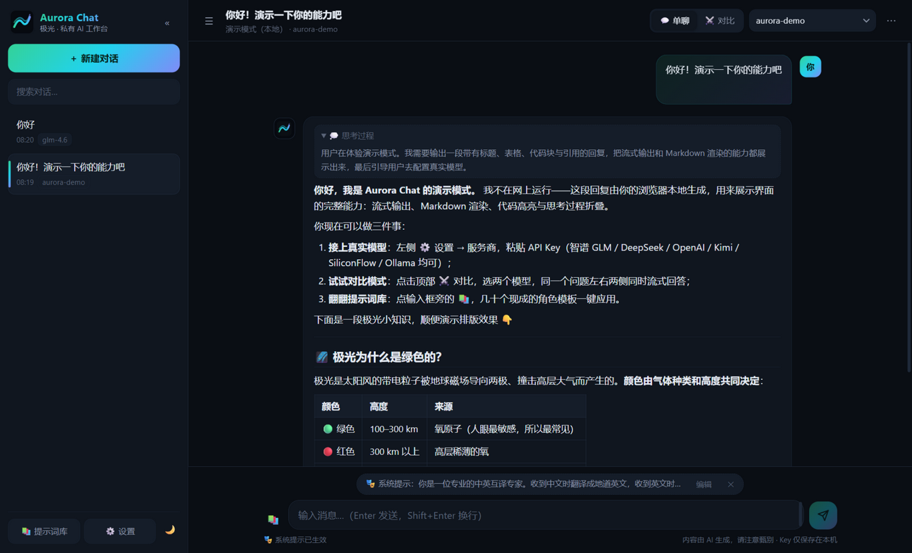
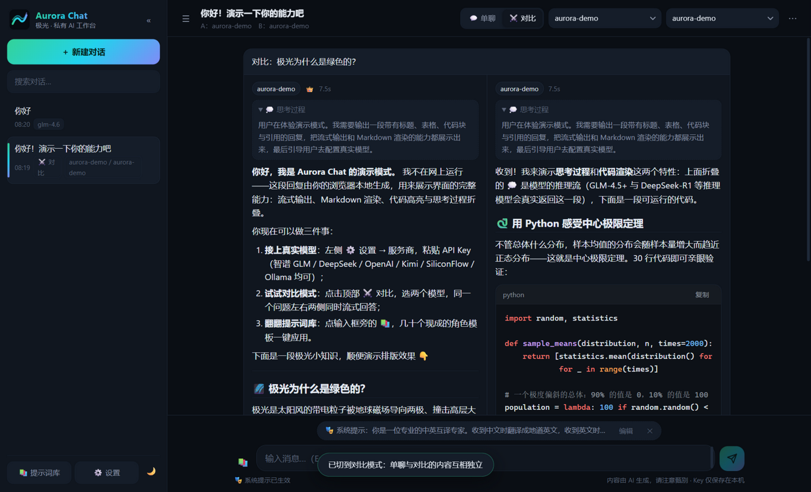

# Aurora Chat · 极光

**纯静态、零后端的私有 AI 聊天工作台。** 浏览器直连各大模型服务商 API，没有服务器、没有账号体系，对话与 API Key 全部只存在你自己的浏览器里。

**在线体验：<https://daixuan.cloud/aurora-chat/>**

<p align="center">
  
&nbsp;
  
</p>

## ✨ 特性

- **多服务商直连** —— 智谱 GLM / DeepSeek / OpenAI / Moonshot Kimi / SiliconFlow / Ollama / LM Studio，以及任意 OpenAI 兼容接口（自定义 Base URL）
- **流式输出** —— SSE 逐字渲染，支持随时停止；推理模型（GLM-4.5+ / DeepSeek-R1）的**思考过程**折叠展示
- **⚔️ 对比模式** —— 灵感来自 [LMSYS Chatbot Arena](https://lmarena.ai)：同一个问题同时发给两个模型，左右两列并行流式作答，投票标记更优的一方
- **📚 提示词库** —— 灵感来自 [awesome-chatgpt-prompts](https://github.com/f/awesome-chatgpt-prompts)：内置 18 个角色模板（翻译、代码审查、周报、费曼讲解、模拟面试…），一键应用为系统提示，也可保存自己的模板
- **完整 Markdown** —— 代码高亮 + 一键复制、表格、引用（marked + highlight.js + DOMPurify 防 XSS）
- **对话管理** —— 侧栏多会话、搜索、重命名、自动标题、系统提示（按会话生效）
- **消息操作** —— 复制、重新生成、编辑用户消息并重发、删除
- **数据自主** —— 一键导出/导入全部数据（JSON）、单篇对话导出 Markdown
- **演示模式** —— 不配 Key 也能完整体验界面（本地生成的演示回复）
- **深浅主题** —— 极光配色深色主题 + 浅色主题，移动端自适应

## 🚀 快速开始

无需构建，任选其一：

```bash
# 方式一：本地起个静态服务器（推荐）
cd aurora-chat
python -m http.server 8642
# 打开 http://127.0.0.1:8642

# 方式二：直接双击 index.html 也能用（演示模式、界面全部可用）
```

1. 点 **🚀 一键体验** 先看看界面；
2. 点 **⚙️ 设置 → 服务商**，选择预设（如「智谱 GLM」），粘贴你的 API Key，先点 **🔌 测试连接** 确认能通，再保存；
3. 保存后该服务商会自动成为默认服务商，顶部下拉框选模型，开聊。

> 各服务商控制台：[智谱开放平台](https://open.bigmodel.cn) · [DeepSeek](https://platform.deepseek.com) · [OpenAI](https://platform.openai.com) · [Moonshot](https://platform.moonshot.cn) · [SiliconFlow](https://siliconflow.cn)

### 部署到自己的站点（GitHub Pages / 任意静态托管）

```bash
cd aurora-chat
git init && git add -A && git commit -m "feat: Aurora Chat v1.0.0"
# 在 GitHub 建一个仓库后：
git remote add origin https://github.com/<你的用户名>/<仓库名>.git
git push -u origin main
# 仓库 Settings → Pages → 选择 main 分支根目录即可
```

## 🔐 服务商与浏览器直连

纯前端应用意味着请求由**你的浏览器直接发往服务商**。以下为 2026-10 实测的 CORS 预检结果：

| 服务商 | Base URL | 浏览器直连 |
| --- | --- | --- |
| 智谱 GLM | `https://open.bigmodel.cn/api/paas/v4` | ✅ |
| DeepSeek | `https://api.deepseek.com` | ✅ |
| OpenAI | `https://api.openai.com/v1` | ⚠️ 需自建代理 |
| Moonshot Kimi | `https://api.moonshot.cn/v1` | ✅ |
| SiliconFlow | `https://api.siliconflow.cn/v1` | ✅ |
| Ollama | `http://localhost:11434/v1` | ⚠️ 需设 `OLLAMA_ORIGINS=*` |
| LM Studio | `http://localhost:1234/v1` | ⚠️ 需在其开发者设置开启 CORS |

遇到不支持直连的服务商？部署仓库里的 [examples/cors-proxy-worker.js](examples/cors-proxy-worker.js)（Cloudflare Worker 免费额度即可），把 Base URL 指向你的 Worker 就行。

> 不确定能不能通？在服务商编辑框里点 **🔌 测试连接**——它会用你填的 Base URL 与 Key 发一次真实请求，
> 直接告诉你"连接正常"还是"被跨域拦截"，不用等到发消息才发现配置有问题。

## 🛡️ 隐私

- 对话记录、API Key、配置**只写入本机 `localStorage`**，没有后端、没有统计埋点；
- 请求不经过任何中间服务器（直连模式），服务商各自按其隐私政策处理数据；
- 导出的备份 JSON **包含 API Key**，请妥善保管。

## 📁 目录结构

```
aurora-chat/
├── index.html          # 页面骨架 + 演示模式文案
├── css/style.css       # 极光主题（深/浅色）
├── js/
│   ├── constants.js    # 服务商预设、提示词模板
│   ├── storage.js      # localStorage 封装、导入导出
│   ├── markdown.js     # marked + DOMPurify + 代码块增强
│   ├── api.js          # OpenAI 兼容流式/非流式、演示流
│   └── app.js          # 状态与 UI（原生 JS，无框架）
├── vendor/             # marked / DOMPurify / highlight.js（本地化，无 CDN 依赖）
├── examples/           # Cloudflare Worker 反代示例
└── docs/               # 截图
```

无框架、无构建步骤 —— 改完刷新即生效，欢迎按自己的需求魔改。

## 🙏 致谢

交互参考了这些优秀的开源项目：[lobe-chat](https://github.com/lobehub/lobe-chat)、[open-webui](https://github.com/open-webui/open-webui)、[LMSYS Chatbot Arena](https://github.com/lm-sys/FastChat)、[awesome-chatgpt-prompts](https://github.com/f/awesome-chatgpt-prompts)；依赖 [marked](https://github.com/markedjs/marked)、[DOMPurify](https://github.com/cure53/DOMPurify)、[highlight.js](https://github.com/highlightjs/highlight.js)。

## 📄 开源与商用说明

**本项目采用 [MIT 许可证](LICENSE)（© 2026 daixuan）开源。**

这意味着：

- ✅ **可以免费使用**——个人学习、科研、团队内部部署均可；
- ✅ **可以商用**——接入自己的 API Key 对外提供服务、作为商业产品的一部分、公司内部工具，均无需付费、无需取得授权；
- ✅ **可以修改与再分发**——包括二次开发后闭源发布（MIT 不要求你开源你的修改）；
- 📌 **唯一义务**——在软件或其副本中保留原作者的版权声明与 MIT 许可证文本（本项目各文件顶部声明、`LICENSE` 文件即满足此要求）；
- ⚠️ **不提供商标**——"Aurora Chat / 极光"名称与 Logo 不随代码转让，二次分发时建议更换品牌标识以避免混淆。

### 第三方组件

本项目捆绑的开源库及其许可证（全文与版权声明见 [THIRD-PARTY-NOTICES.md](THIRD-PARTY-NOTICES.md)，各 `vendor/` 文件头部保留原始声明）：

| 组件 | 用途 | 许可证 |
| --- | --- | --- |
| [marked](https://github.com/markedjs/marked) v12.0.2 | Markdown 解析 | MIT |
| [DOMPurify](https://github.com/cure53/DOMPurify) v3.1.6 | XSS 防护 | Apache-2.0 或 MPL-2.0 |
| [highlight.js](https://github.com/highlightjs/highlight.js) v11.9.0 | 代码高亮 | BSD-3-Clause |

均为宽松许可（permissive license），**不影响本项目或你的衍生作品商用**；上述组件的许可义务（保留其版权与许可声明）由本项目通过本文件与 `vendor/` 文件头代为履行，你再分发本项目（含修改版）时应保留这两个部分。

### 免责声明

- 本软件按"**现状**"提供（MIT 免责条款），作者不对适用性、不中断、数据丢失等承担责任；
- AI 生成的内容由所接入的模型服务商产生，**不构成专业建议**，请自行甄别核实；
- 部署和使用本应用时，须同时遵守你所接入的各模型服务商的服务条款与当地法律；
- API Key 与由此产生的费用、数据隐私由使用者自行管理，请勿将 Key 填入不受你控制的公开部署实例。

> 想改用其他许可（如禁商用的 CC BY-NC）？替换 `LICENSE` 并同步修改本节即可——但请注意代码许可证与文档/内容许可证是两回事，分开声明更清晰。

